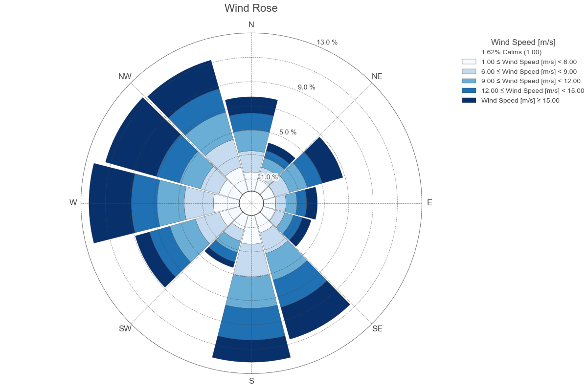
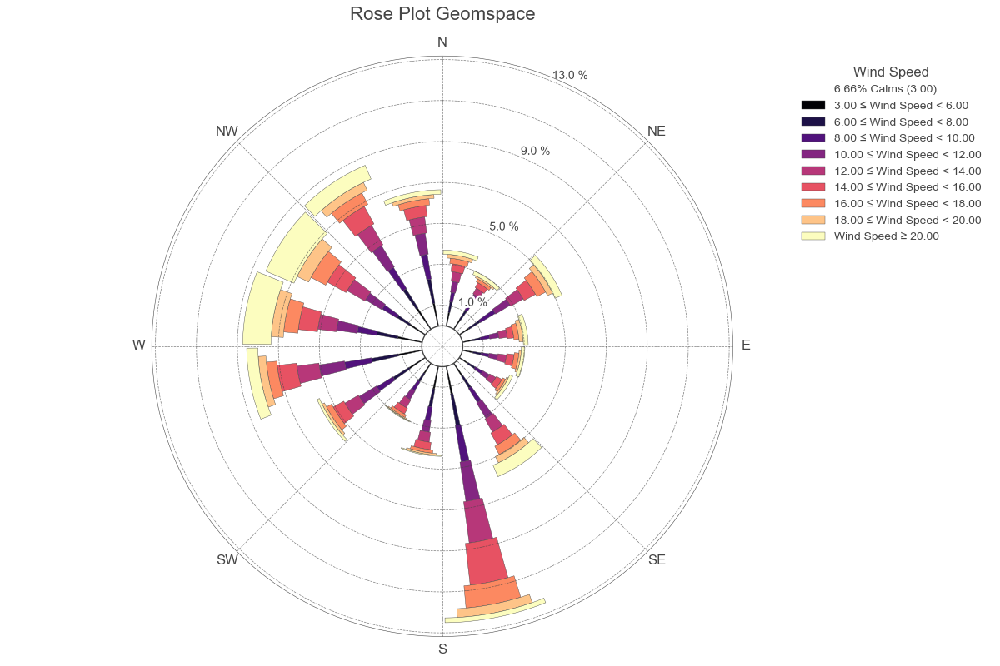

Data visualization tools
************************

Tools related to data visualization are contained within the ``plotting`` package available through:

.. code:: Python

    from coastlib import plotting

Rose Plot
=========

.. code:: Python

    from coastlib.plotting import rose_plot

|rose_plot_1 Image| |rose_plot_2 Image|

