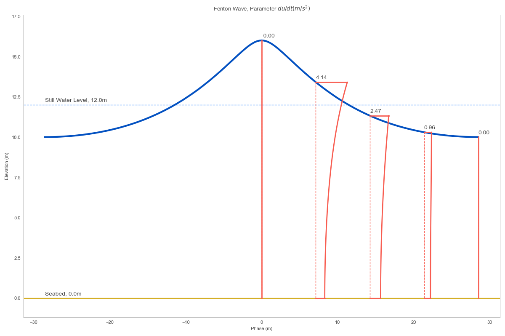

Water wave analysis
*******************

Tools related to water wave analysis are contained within the ``waves`` package available through:

.. code:: Python

    from coastlib import waves

FentonWave Module
=================
The FentonWave module is a high level interface to John D Fenton's steady water wave solver `Fourier program`_. The Fourier program solves a steady two-dimensional periodic wave propagating without change of form over a layer of fluid on a horizontal bed. The FentonWave module provides a pythonic way of creating a FentonWave object exposing the steady wave solution results and methods for visualizing wave summary. The FentonWave object stores all data in pandas DataFrame and numpy array objects, which allow for simple integration with other functions and classes.

Shown below is a simple example of using the FentonWave class to calculate a steady wave:

>>> from coastlib.waves import FentonWave
>>> wave = FentonWave(wave_height=3, wave_period=6, depth=20)
>>> wave
                            Fenton Wave
    ===========================================================
                                              Unit        Value
    Parameter                                                  
    depth                                        m       20.000
    wave length                                  m       56.516
    wave height                                  m        3.000
    wave period                                  s        6.000
    wave speed                                 m/s        9.419
    eulerian current                           m/s        0.000
    stokes current                             m/s        0.058
    mean fluid_speed                           m/s        9.419
    wave volume flux                         m^2/s        1.168
    bernoulli constant r                   (m/s)^2       44.390
    volume flux                              m^2/s      187.220
    bernoulli constant R                   (m/s)^2      240.523
    momentum flux                  kg/s^2 or (N/m)  3813694.427
    impulse                               kg/(m*s)     1197.458
    kinetic energy                 kg/s^2 or (N/m)     5639.670
    potential energy               kg/s^2 or (N/m)     5557.035
    mean square of bed velocity            (m/s)^2        0.055
    radiation stress               kg/s^2 or (N/m)     7023.656
    wave_power                   kg*m/s^3 or (W/m)    60062.853
    ===========================================================
>>> wave.plot()

|FentonWave Image|

An in-depth tutorial for the ``waves`` module is available in `this Jupyter notebook`_.

.. _Fourier program: https://johndfenton.com/Steady-waves/Fourier.html
.. _this Jupyter notebook: https://github.com/georgebv/coastlib-notebooks

